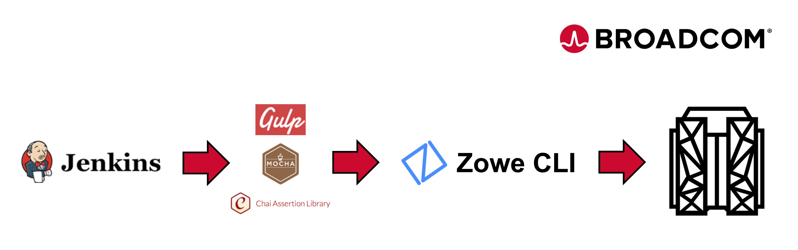

Now we need to install the plugins for this scenario.

Install the Endevor Plugin:
`zowe plugins install @broadcom/endevor-for-zowe-cli`{{execute}}

Install the File Master Plus Plugin:
`zowe plugins install @broadcom/file-master-plus-for-zowe-cli`{{execute}}

Install the Ops Plugin:
`zowe plugins install @broadcom/ops-for-zowe-cli`{{execute}}